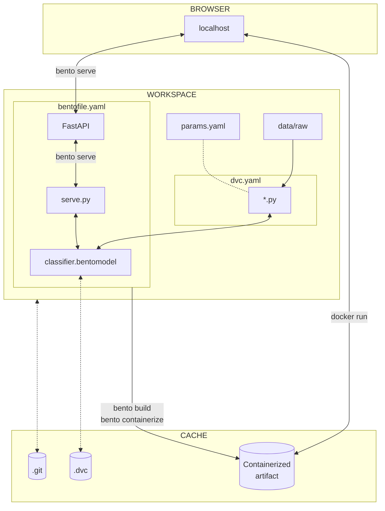

# Conclusion

Congratulations! You did it!

In this third part, you were able to move the model outside of the experiment
context. The model is now saved and loaded with BentoML. You can serve the model
locally.

The model is now ready to be used in production.

The following diagram illustrates the bricks you set up at the end of this part:

The main goal of the MLOps process is to ensure that the model is reproducible,
reliable and can be used in production. This goal is now achieved.
